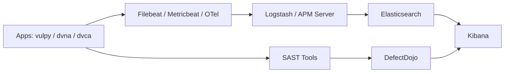
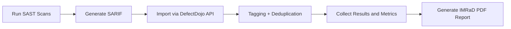
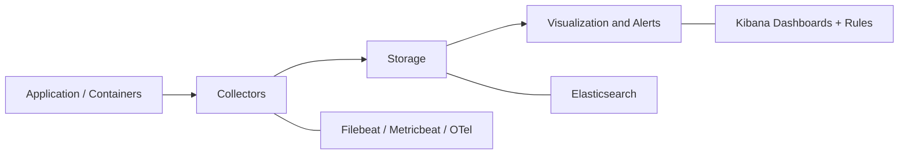

# SSD Project: Observability + Vulnerability Management

This repository contains a Secure System Development course project that integrates:

- Vulnerability management with DefectDojo
- Observability with ELK (`Elasticsearch`, `Logstash`, `Kibana`)
- Automated scan-to-report workflow

The top-level repository orchestrates infrastructure from git submodules.

---

## Introduction

Security testing and runtime monitoring are often handled separately, which makes triage, investigation, and reporting harder.  
This project combines both directions in one reproducible environment:

- static detection of vulnerabilities (SAST),
- centralized vulnerability management (DefectDojo),
- runtime telemetry collection (logs, metrics, traces),
- visualization and alerting in Kibana,
- automated IMRaD report generation.

### Objectives

- Deploy DefectDojo and ELK with cross-platform scripts.
- Run SAST against multiple vulnerable applications.
- Import findings to DefectDojo with tags and deduplication.
- Ingest logs/metrics/traces and CISA KEV feed into Elasticsearch.
- Build Kibana dashboards and alert rules.
- Generate final report artifacts for defense/demo.

---

## Methods

### System Architecture Diagram



### Data Flow Diagram (SAST -> DefectDojo -> Report)



### Observability Pipeline Diagram



### 1) Repository and Submodules

Compose definitions are provided via submodules:

- `defectdojo` -> [DefectDojo/django-DefectDojo](https://github.com/DefectDojo/django-DefectDojo)
- `elk` -> [AlliumPro/docker-elk](https://github.com/AlliumPro/docker-elk.git)

Without submodules, startup scripts will not work.

### 2) Components

- **DefectDojo** for vulnerability management
- **Elasticsearch** for indexing/storage
- **Logstash** for pipeline processing
- **Kibana** for query, dashboards, and rules
- **Filebeat** for logs
- **Metricbeat** for metrics
- **APM Server** for OTLP traces
- **OpenTelemetry trace generator** for demo traces
- **CISA KEV feed ingestion** through Logstash `http_poller`

### 3) Deployment and Reliability

Cross-platform scripts:

- Bash: `scripts/init.sh`, `scripts/up.sh`, `scripts/down.sh`, `scripts/verify_observability.sh`
- PowerShell: `scripts/init.ps1`, `scripts/up.ps1`, `scripts/down.ps1`, `scripts/verify_observability.ps1`

Startup includes:

- ELK setup (users and roles),
- ELK core services,
- observability extensions (`filebeat`, `metricbeat`, `apm-server`),
- DefectDojo build/startup,
- Juice Shop demo container startup,
- DefectDojo admin password extraction from initializer logs.

Health checks validate:

- required containers running,
- required datasets available (`metricbeat-*`, `logs-observability-*`, `cisa-kev-*`, `traces-apm*`).

### 4) SAST Automation and DefectDojo Integration

Implemented with `sast_automation.py`:

1. Clone vulnerable apps (`vulpy`, `dvna`, `dvca`)
2. Run scanners (`Bandit`, `NjsScan`, `Flawfinder`)
3. Handle SARIF-compatible outputs
4. Import to DefectDojo (`/api/v2/import-scan/`)
5. Apply tags:
   - `tool:*`
   - `project:*`
   - `severity:*`
   - `priority:*`
   - `sast`, `automated`

Deduplication requires enabling `Deduplication within this engagement only` in DefectDojo engagement settings.

### 5) Observability Pipeline

Implemented data flows:

- Logs: `Filebeat -> Logstash -> Elasticsearch` -> `logs-observability-*`
- Metrics: `Metricbeat -> Elasticsearch` -> `metricbeat-*`
- Traces: `OpenTelemetry -> APM Server -> Elasticsearch` -> `traces-apm*`
- External feed: `CISA KEV -> Logstash -> Elasticsearch` -> `cisa-kev-*`

Trace demo command:

```bash
python3 scripts/generate_traces.py --count 60 --delay 0.2
```

### 6) Dashboards and Alerts

Used Kibana Data Views:

- `metricbeat-*`
- `logs-observability-*`
- `cisa-kev-*`
- `traces-apm*`

Used KQL examples:

- `message : ("*error*" or "*exception*" or "*failed*")`
- `message : ("*UNION SELECT*" or "*../*" or "*<script*" or "*sqlmap*" or "*or 1=1*")`
- `container.name : *`
- `span.name : ("pipeline.scan_to_report" or "stage.import_defectdojo")`

Built dashboard:

- `SSD Observability Dashboard`
  - Container CPU Over Time
  - Container RAM Over Time
  - Error Logs Trend
  - Suspicious Requests by Container
  - CISA KEV Feed Activity

Configured rules:

- `SSD High CPU Container`
- `SSD Suspicious Request`

### 7) Scan-to-Report Pipeline

Automated flow:

- scan -> import to DefectDojo -> tagging -> evidence -> PDF report

Generated artifacts:

- `artifacts/scan_to_report_summary_<timestamp>.json`
- `artifacts/SSD_IMRaD_Report_<timestamp>.pdf`

PDF contains:

- IMRaD sections
- System architecture diagram
- `SAST -> DefectDojo -> Report` data-flow diagram
- `Application -> Collector -> Storage -> Visualization` diagram

---

## Results

### 1) Deployment

Stack initialization and startup completed successfully through scripts.  
Core services (`elasticsearch`, `logstash`, `kibana`, `filebeat`, `metricbeat`, `apm-server`) were validated as running.

### 2) Data Availability

Required datasets were present:

- `metricbeat-*`
- `logs-observability-*`
- `cisa-kev-*`
- `traces-apm*`

### 3) Vulnerability Workflow

SAST findings were imported to DefectDojo with tags and deduplication-ready behavior across repeated runs.

### 4) Observability and Detection

Dashboard and KQL checks showed:

- CPU/RAM trends,
- app error visibility,
- suspicious request detection,
- trace visibility by pipeline stage,
- KEV feed activity.

Alert rules were enabled for:

- high CPU condition,
- suspicious request patterns.

### 5) Reporting

The end-to-end pipeline generated timestamped JSON/PDF artifacts with diagrams and evidence for final demo/defense.

Generated report example: [SSD_IMRaD_Report_20260426_230051.pdf](https://disk.yandex.ru/i/q2NJyFUTC28_CQ).

---

## Discussion

### Strengths

- Unified security and observability workflow.
- Centralized findings and cleaner triage through DefectDojo.
- Practical ELK telemetry and rule-based alerting.
- Reproducible setup on Linux/macOS and Windows.

### Limitations

- Suspicious-pattern queries can produce false positives if not tuned.
- Severity analytics in Kibana require explicit sync design with DefectDojo.
- Visual density depends on activity volume and selected time range.

### Future Improvements

- Add notification connectors (Slack/email/webhook).
- Improve correlation between SAST findings and runtime anomalies.
- Expand retention and lifecycle policies.
- Instrument real application traces beyond synthetic generation.

---

## Team Contributions

- **Adelina Karavaeva**: reproducible stack deployment, automation scripts, and initial infrastructure documentation.
- **Alena Starikova**: SAST automation and DefectDojo import/tagging/deduplication.
- **Ivan Murzin**: observability architecture and implementation (logs/metrics/traces/KEV).
- **Maria Rokkel**: Kibana Data Views, KQL validation, dashboard, and alert rules.
- **Aliya Sagdieva**: automated scan-to-report workflow and IMRaD PDF generation.

---

## Practical Runbook

### 1) Clone with submodules

Preferred:

```bash
git clone --recurse-submodules https://github.com/ElinaNotElina/SSD_project.git
cd SSD_project
```

If cloned without submodules:

```bash
git submodule update --init --recursive
```

### 2) One-time initialization

Linux/macOS:

```bash
bash scripts/init.sh
```

Windows PowerShell:

```powershell
powershell -ExecutionPolicy Bypass -File scripts/init.ps1
```

### 3) Start system

Linux/macOS:

```bash
bash scripts/up.sh
```

Windows PowerShell:

```powershell
powershell -ExecutionPolicy Bypass -File scripts/up.ps1
```

### 4) Prepare DefectDojo context for SAST import

After stack startup:

1. Open DefectDojo: `http://localhost:8080`
2. Create Product (example: `SSD Project`)
3. Create Engagement and enable deduplication
4. Get DefectDojo API token

### 5) Run SAST and import findings into DefectDojo

Linux/macOS:

```bash
python3 -m venv venv
source venv/bin/activate
pip install -r requirements.txt
python3 sast_automation.py
```

Windows PowerShell:

```powershell
python -m venv venv
venv\Scripts\Activate.ps1
pip install -r requirements.txt
python sast_automation.py
```

`sast_automation.py` asks for Product ID, Engagement ID, and API token.

### 6) Generate traces

Linux/macOS:

```bash
python3 scripts/generate_traces.py --count 60 --delay 0.2
```

Windows PowerShell:

```powershell
python scripts/generate_traces.py --count 60 --delay 0.2
```

### 7) Verify observability

Linux/macOS:

```bash
bash scripts/verify_observability.sh
```

Windows PowerShell:

```powershell
powershell -ExecutionPolicy Bypass -File scripts/verify_observability.ps1
```

### 8) Validate dashboards and alerts in Kibana

Open Kibana: `http://localhost:5601`

1. Confirm Data Views exist:
   - `metricbeat-*`
   - `logs-observability-*`
   - `cisa-kev-*`
   - `traces-apm*`
2. Open dashboard `SSD Observability Dashboard` and verify widgets for CPU/RAM, error logs, suspicious requests, and KEV activity.
3. In Discover, validate KQL examples:
   - `message : ("*error*" or "*exception*" or "*failed*")`
   - `message : ("*UNION SELECT*" or "*../*" or "*<script*" or "*sqlmap*" or "*or 1=1*")`
4. In Rules, confirm alerts are enabled:
   - `SSD High CPU Container`
   - `SSD Suspicious Request`

### 9) Generate final scan-to-report artifacts (before shutdown)

Linux/macOS:

```bash
python3 scripts/scan_to_report.py \
  --product-id 5 \
  --engagement-id 5 \
  --dojo-token <DEFECTDOJO_API_TOKEN>
```

Windows PowerShell:

```powershell
powershell -ExecutionPolicy Bypass -File scripts/run_scan_to_report.ps1 `
  -ProductId 5 `
  -EngagementId 5 `
  -DojoToken <DEFECTDOJO_API_TOKEN>
```

Optional evidence screenshots folder:

```text
artifacts/evidence/
```

### 10) Stop system

Linux/macOS:

```bash
bash scripts/down.sh
```

Windows PowerShell:

```powershell
powershell -ExecutionPolicy Bypass -File scripts/down.ps1
```

---

## Services and Credentials

- DefectDojo: `http://localhost:8080`
- Kibana: `http://localhost:5601`
- APM OTLP endpoint: `http://localhost:8200/v1/traces`

ELK defaults:

- Username: `elastic`
- Password: `changeme`

DefectDojo:

- Username: `admin`
- Password: generated at runtime

Get DefectDojo admin password:

```bash
docker compose -f defectdojo/docker-compose.yml logs initializer
```

---

## Notes

- First startup may take several minutes (image pull/build).
- `init` is required at least once after fresh clone.
- For additional demo container ingestion into `logs-observability-*`:

```bash
docker run --label ssd.observability=true ...
```
